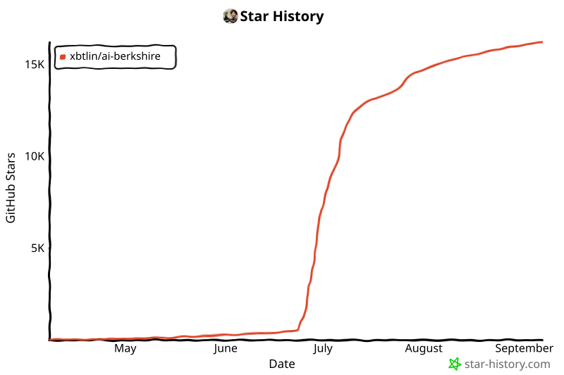

中文 | [English](README_EN.md) | [日本語](README_JA.md)

[](https://trendshift.io/repositories/63696)

# AI Berkshire - AI 時代的價值投資研究框架

> "Price is what you pay, value is what you get." — Warren Buffett
>
> 用 AI 重新定義投資研究的深度與效率。

**AI Berkshire** 是一套同時兼容 Claude Code 與 Codex 的投資研究 Skill 合集，將巴菲特、芒格、段永平、李錄四位價值投資大師的方法論系統化、結構化，通過 AI Agent 實現專業級投資研究。

一個人 + Claude Code / Codex = 一個投研團隊。

> 📮 **倉庫是全量框架，公衆號是精選。** 真正值得深研的公司，加上報告之外我自己的判斷與取捨，都在微信公衆號「**複利煉丹爐**」——[掃碼關注 ↓](#精選研究首發於公衆號)

[實盤業績](#real-track-record) · [爲什麼不能直接問AI](#爲什麼不能直接問-ai) · [Skills 一覽](#skills-一覽20個) · [快速開始](#快速開始) · [實戰報告](#實戰研究報告) · [設計理念](#設計理念) · [公衆號](#精選研究首發於公衆號)

---

## Real Track Record

> 不是紙上談兵。這套框架背後是真金白銀驗證的投資體系。

### 2024 全年收益：+69.29%


### 2025 全年收益：+66.38%


### 與主要指數對比

| 指標 | 2024 全年 | 2025 全年 |
|------|----------|----------|
| **本框架實盤** | **+69.29%** | **+66.38%** |
| 恒生指數 | +17.67% | +27.77% |
| 標普500 | +23.31% | +16.39% |
| 滬深300 | +14.68% | +17.66% |
| 納斯達克 | +28.64% | +20.36% |

**2024 年超額收益**：跑贏標普500 **46個百分點**，跑贏恒生指數 **52個百分點**

**2025 年超額收益**：跑贏標普500 **50個百分點**，跑贏恒生指數 **39個百分點**

**兩年累計實盤收益超 146萬元**，連續兩年大幅跑贏全球主要指數。

> *免責聲明：歷史收益不代表未來表現。截圖來自富途證券真實賬戶。*

### 精選研究首發於公衆號

倉庫裏是完整的框架和全量報告，公衆號裏是**精選**——真正值得深研的公司，加上報告之外我自己的判斷與取捨：


**複利煉丹爐** —— 用 AI 煉投研這顆丹。

---

## 爲什麼不能直接問 AI？

你當然可以直接問 Claude："幫我分析拼多多值不值得買"。你會得到一篇"一方面...另一方面..."的平衡分析，最後以"投資有風險，請自行判斷"收尾。

**這種分析看起來對，但沒法拿來做決策。**

AI Berkshire 解決的不是"能不能分析"的問題，而是**分析質量和決策紀律**的問題。以下是核心差異：

### 1. 強制給結論，不打太極

直接問AI，你得到的是兩面討好的"分析"。AI Berkshire 強制輸出：**通過/不通過/灰色地帶**，帶具體價格區間和分層建議。

> 普通AI回答：*"拼多多有增長潛力但也面臨競爭壓力，投資者需要權衡..."*
>
> AI Berkshire 輸出：

> | 策略 | 建議 | 價格區間 |
> |------|------|---------|
> | 激進型 | 當前價位可建倉20% | $95-105 |
> | 穩健型 | 等回購政策明確後建倉 | $85-95 |
> | 保守型 | 不符合10年確定性標準，觀望 | — |
>
> **鏡子測試**：5句話說不完整 = 不買，沒有例外。

### 2. 四大師視角對抗，而非單一分析

不是"用巴菲特方法分析一下"這麼簡單。四個視角會產生**真實的矛盾和張力**——

以拼多多爲例：
- **段永平**（商業模式）：好生意，C2M模式難以複製 → 評分 3.7/5
- **巴菲特**（財務估值）：扣現金PE僅6.3x，印鈔機 → 評分 4.4/5
- **芒格**（逆向思考）：護城河比想象中淺，抖音3年做到4萬億GMV → 評分 3.5/5
- **李錄**（長期確定性）：管理層文化有隱患，10年後不確定 → 評分 2.0/5

**巴菲特說"真便宜"，李錄說"不確定就不買"**——這種衝突纔是投資決策的真實狀態。單一prompt無法制造這種多視角對抗，而這恰恰是避免盲點的關鍵。

### 3. 結構化反偏見機制

AI最危險的不是給錯答案，而是給一個**看起來很對但經不起推敲**的答案。AI Berkshire 在流程中內置了多層"防騙"機制：

| 機制 | 解決什麼問題 | 舉例 |
|------|------------|------|
| **信息豐富度評級（A/B/C）** | 防止"資料多=確定性高"的幻覺 | 泡泡瑪特評爲B級：數據有限，推算指標標註置信度 |
| **芒格式逆向檢驗** | 強制思考失敗場景 | "什麼情況下拼多多會死？"→ 列出5大情景及概率 |
| **快速否決清單** | 8條紅線一票否決 | 管理層誠信污點 → 直接否決，不管估值多便宜 |
| **反共識檢查** | 避免和市場想法一樣 | "聰明人爲什麼在做空？"→ 發現被忽視的風險 |
| **留白原則** | 寧可說"不知道" | 數據不足時標註"灰色地帶"，不用推測僞裝確定性 |

### 4. 金融數據的精確性

LLM心算不可靠。PE算錯一個小數點、市值單位搞混港幣和人民幣，就可能導致錯誤的投資決策。

**真實案例**：分析騰訊時，不同來源的市值數據有"港幣億"和"人民幣億"兩種單位。AI Berkshire 的處理方式：

```bash
# 市值手算校驗：股價 × 總股本，與報告數據對比
python3 tools/financial_rigor.py verify-market-cap \
  --price 510 --shares 9.11e9 --reported 4.65e12 --currency HKD
# ✅ 驗證通過, 偏差僅 0.08%
```

所有計算使用 Python `decimal.Decimal`（精確十進制），不用 `float`。關鍵數據至少2個獨立來源交叉驗證。

### 5. 可復現的研究流程

直接問AI，每次輸出的格式、深度、覆蓋面都不一樣——今天分析騰訊有護城河評分，明天分析美團可能就忘了。

AI Berkshire 確保：**同樣的輸入 → 結構一致、深度一致的輸出**。這意味着你可以：
- 7家公司橫向對比，評分標準完全一致
- 同一家公司半年後重新分析，直接對比變化
- 團隊成員之間的研究結果可以對齊

> 真實輸出——7家公司用同一標準 Checklist 篩選：
>
> | 公司 | 通過? | 能力圈 | 好生意 | 護城河 | 管理層 | 安全邊際 | 綜合 |
> |------|:-----:|:------:|:------:|:------:|:------:|:-------:|:----:|
> | 茅臺 | ✅ 通過 | ★★★★★ | ★★★★★ | ★★★★★ | ★★★☆☆ | ★★★★☆ | 4.7 |
> | 騰訊 | ✅ 通過 | ★★★★☆ | ★★★★★ | ★★★★★ | ★★★★★ | ★★★★☆ | 4.7 |
> | 英偉達 | ✅ 有條件 | ★★★★☆ | ★★★★★ | ★★★★★ | ★★★★★ | ★★★☆☆ | 4.3 |
> | 美團 | ✅ 有條件 | ★★★★☆ | ★★★★☆ | ★★★★☆ | ★★★★☆ | ★★★★☆ | 4.0 |
> | 快手 | ✅ 有條件 | ★★★☆☆ | ★★★★☆ | ★★★★☆ | ★★★★☆ | ★★★★★ | 4.0 |
> | 拼多多 | ❓ 灰色 | ★★★★☆ | ★★★★☆ | ★★★☆☆ | ★★★☆☆ | ★★★★★ | 3.8 |
> | 泡泡瑪特 | ❓ 灰色 | ★★★☆☆ | ★★★★☆ | ★★★★☆ | ★★★★★ | ★★★☆☆ | 3.7 |

### 6. 多Agent並行 = 研究深度的倍增

`/investment-team` 啓動4個獨立Agent**同時**研究一家公司。每個Agent各自搜索網絡、交叉驗證數據、獨立給出結論。這不是把一個prompt拆成四段——是4個"分析師"各自做了完整的研究，Team Lead再綜合。

一個人直接問AI，上下文窗口是一個。4個Agent並行，等於4倍的搜索量、4倍的信息源、4個獨立視角。

<p align="center">
  
</p>

### 一句話總結

> **普通人問AI得到的是"看起來對的分析"，用 AI Berkshire 得到的是"可以拿來做決策的投研報告"。**

---

## 整體架構

<p align="center">
  
</p>


**三層設計哲學**：
- **Skill 層**：把"你要做什麼"抽象成 20 個明確入口——深度研究、財報分析、行業篩選、持倉管理、思維工具，按場景選用
- **Agent 層**：團隊型 skill（如 `/investment-team`、`/earnings-team`）由 Team Lead 並行調度 4 個大師視角 Agent——各自獨立搜索、獨立判斷、互相挑戰，最後綜合研判；輕量 skill 不經過這一層，直連工具快進快出
- **工具層**：精確計算、實時檢索、報告抽檢——保證每份報告的數據嚴謹性可驗證

---

## Skills 一覽（20個）

### 🔬 深度研究類

| Skill | 用途 | 適合場景 |
|-------|------|---------|
| [`/investment-research`](skills/investment-research.md) | 四大師綜合深度分析 | 對一家上市公司進行全方位投資研究 |
| [`/investment-team`](skills/investment-team.md) | 多Agent並行投研團隊 | 4個Agent並行研究，最快速、最全面 |
| [`/management-deep-dive`](skills/management-deep-dive.md) | 管理層縱深研究 | "買股票就是買人"——當管理層是核心變量時深挖 |
| [`/private-company-research`](skills/private-company-research.md) | 未上市公司深度研究 | 研究螞蟻、SpaceX等信息稀缺的未上市公司 |
| [`/deep-company-series`](skills/deep-company-series.md) | 8篇長文系列拆一家公司 | 公衆號級深度系列，12萬字從認知重置到決策閉環 |

### 📊 財報分析類

| Skill | 用途 | 適合場景 |
|-------|------|---------|
| [`/earnings-review`](skills/earnings-review.md) | 財報精讀（一手資料） | 只讀原始財報，不依賴二手研報，像巴菲特一樣讀年報 |
| [`/earnings-team`](skills/earnings-team.md) | 財報精讀團隊 + 公衆號發佈 | 四大師並行解讀財報 → 編輯潤色 → 讀者評審 → 可發佈文章 |

### 🏭 行業篩選類

| Skill | 用途 | 適合場景 |
|-------|------|---------|
| [`/industry-research`](skills/industry-research.md) | 產業鏈全景掃描 | 研究一個行業的全部投資機會（按產業鏈環節切片） |
| [`/industry-funnel`](skills/industry-funnel.md) | 行業漏斗篩選 | 全市場 → 粗篩 ≤10 家 → 終選 3 家深度分析 |
| [`/quality-screen`](skills/quality-screen.md) | 去劣篩選（7條硬指標） | 快速排除非一流公司，支持個股/行業/指數/主題批量篩 |
| [`/bottleneck-hunter`](skills/bottleneck-hunter.md) | 供應鏈瓶頸獵手 | 從超級趨勢出發，尋找產業鏈物理瓶頸和套利機會 |
| [`/investment-checklist`](skills/investment-checklist.md) | 巴菲特買入前 Checklist | 六關快速篩選，10分鐘決定是否值得深入 |

### 📈 持倉管理類

| Skill | 用途 | 適合場景 |
|-------|------|---------|
| [`/income-investment`](skills/income-investment.md) | 收益型股票分析 | 區分可持續收益、機會型高息與收益率陷阱 |
| [`/portfolio-review`](skills/portfolio-review.md) | 組合管理與優化 | 從"研究公司"升級到"管理組合"——倉位、集中度、再平衡 |
| [`/thesis-tracker`](skills/thesis-tracker.md) | 投資論文追蹤 | 買入後的紀律系統：持續跟蹤論文是否被證僞 |
| [`/thesis-drift`](skills/thesis-drift.md) | 投資論文漂移檢測 | 對比兩份論文/報告，區分事實變化、估值變化與措辭變化 |
| [`/news-pulse`](skills/news-pulse.md) | 股價異動快速歸因 | 股價大漲/大跌時10分鐘搞清"發生了什麼" |

### 🧠 思維工具類

| Skill | 用途 | 適合場景 |
|-------|------|---------|
| [`/dyp-ask`](skills/dyp-ask.md) | 段永平問答 | 以段永平的方式思考任何問題——商業、投資、人生 |
| [`/financial-data`](skills/financial-data.md) | 財務數據獲取與交叉驗證規範 | 確保關鍵數據來自2個獨立來源，誤差>1%告警 |
| [`/wechat-article`](skills/wechat-article.md) | 微信公衆號文章 | 作者、編輯、讀者三Agent協作，產出可發佈文章 |

---

## 快速開始

### 成本與模型選擇

深度投研類 Skill 默認會進行多輪研究、交叉驗證和多 Agent 綜合判斷，因此 token 消耗較高，這是爲了換取更完整的商業、財務、行業和風險分析。

如果是真實投資決策中高風險、高重要性的判斷，維護者的觀點是：最強模型通常更可能帶來更好的分析 ROI，不建議只爲節省模型成本而犧牲關鍵判斷質量。輕量模型更適合做初篩、摘要或低風險問題；涉及護城河、估值、管理層和風險交叉判斷時，應預期分析質量會更依賴模型能力。

想控制成本時，優先調整 workflow，而不是期待完整深度研究變得便宜：快速排除公司可先用 [`/quality-screen`](skills/quality-screen.md)，股價異動歸因可用 [`/news-pulse`](skills/news-pulse.md)。只有當結果值得繼續深入時，再運行 [`/investment-research`](skills/investment-research.md) 或 [`/investment-team`](skills/investment-team.md)。

### 1. 安裝 AI 客戶端

本倉庫保留同一套 canonical workflow，並分別提供 Claude Code commands 與 Codex skills。按你使用的客戶端安裝即可。

Claude Code 用戶：

```bash
npm install -g @anthropic-ai/claude-code
```

Codex 用戶：

```bash
# macOS / Linux
curl -fsSL https://chatgpt.com/codex/install.sh | sh

# 或使用 npm
npm install -g @openai/codex

# 或使用 Homebrew
brew install --cask codex

# 驗證安裝
codex --version
```

Windows 用戶可使用官方 PowerShell 安裝命令：`powershell -ExecutionPolicy ByPass -c "irm https://chatgpt.com/codex/install.ps1 | iex"`。

如果 `codex --version` 能正常輸出版本號，就可以繼續安裝本項目的 Codex skills。

#### 減少授權確認

這些 skills 會頻繁調用工具，Claude Code 默認會逐次請求授權確認。這個行爲來自 Claude Code 客戶端權限機制，不是本倉庫可以修改的默認設置。

如果你信任當前 workflow，並且在可信環境中運行，可以用 Claude Code 的跳過權限確認模式啓動：

```bash
claude --dangerously-skip-permissions
```

注意：該模式會關閉 Claude Code 的工具審批保護，只應在你信任倉庫、命令和工作目錄的情況下使用。

### 2. 安裝 Skills

Claude Code 用戶安裝（macOS / Linux）：

```bash
# 克隆倉庫
git clone https://github.com/xbtlin/ai-berkshire.git

# 複製 skills 到 Claude Code 全局 commands 目錄
cd ai-berkshire
./scripts/install-claude-commands.sh
```

Claude Code 用戶安裝（Windows PowerShell / Command Prompt）：

```bat
git clone https://github.com/xbtlin/ai-berkshire.git
cd ai-berkshire
.\scripts\install-claude-commands.bat
```

Codex 用戶安裝（macOS / Linux）：

```bash
# 克隆倉庫
git clone https://github.com/xbtlin/ai-berkshire.git

# 生成並安裝 Codex skills 到 ~/.codex/skills
cd ai-berkshire
./scripts/install-codex-skills.sh

# 可選：安裝 Codex slash prompts 到 ~/.codex/prompts
# 用於獲得接近 Claude Code 的 /investment-research 體驗
./scripts/install-codex-prompts.sh
```

Codex 用戶安裝（Windows PowerShell / Command Prompt）：

```bat
git clone https://github.com/xbtlin/ai-berkshire.git
cd ai-berkshire
.\scripts\install-codex-skills.bat

REM 可選：安裝 Codex slash prompts
.\scripts\install-codex-prompts.bat
```

倉庫同時維護三套入口：`skills/*.md` 是 Claude Code command 源文件；`codex-skills/*/SKILL.md` 是 Codex skill 包，由 `scripts/sync-codex-skills.py` 從 `skills/*.md` 生成；`codex-prompts/*.md` 是可選的 Codex slash prompt 兼容層。

### 3. 使用

在 Claude Code 中直接調用：

```bash
# 深度研究
/investment-research 騰訊
/investment-team 美團
/management-deep-dive 王興 美團
/private-company-research SpaceX
/deep-company-series 拼多多

# 財報分析
/earnings-review 騰訊 2025Q4
/earnings-team PDD 2025年報

# 行業篩選
/industry-research 核電
/industry-funnel AI算力
/quality-screen 恒生指數成分股
/bottleneck-hunter AI基礎設施
/investment-checklist 茅臺, 英偉達, 蘋果

# 持倉管理
/income-investment Verizon mode=existing role=core-income quantity=100 cost_basis=39.50 tax_residence=France horizon=5y
/portfolio-review 騰訊30%, 美團20%, 茅臺20%, 現金30%
/thesis-tracker 拼多多
/thesis-drift 拼多多 reports/拼多多-thesis-2025Q4.md reports/拼多多-thesis-2026Q1.md
/news-pulse 騰訊

# 思維工具
/dyp-ask 拼多多的護城河到底在哪裏？
/wechat-article 美團
```

在 Codex 中安裝後重啓 Codex，然後直接按 skill 名稱描述任務，例如：

```text
使用 investment-research 研究騰訊
使用 earnings-review 分析 PDD 2025年報
使用 industry-funnel 篩選 AI算力
使用 bottleneck-hunter 掃描 AI基礎設施瓶頸
使用 thesis-drift 對比拼多多兩份投資論文
使用 wechat-article 寫美團投研文章
```

如果安裝了 Codex slash prompts，重啓 Codex 後也可以在 `/` 菜單裏搜索這些 prompt。Codex 官方的 custom prompt 入口通常顯示爲 `prompts:<name>`，例如：

```text
/prompts:investment-research 騰訊
```

---

## 各 Skill 詳細介紹

### 1. `/investment-research` — 四大師綜合分析

最全面的單公司深度研究框架。按七個模塊順序執行：

```
數據收集 → 生意本質(段永平) → 護城河(巴菲特) → 逆向思考(芒格)
    → 管理層評估(段永平+巴菲特) → 文明趨勢(李錄) → 估值與安全邊際
```

**核心特色**：
- AI研究偏見自覺機制（A/B/C級信息豐富度評級）
- 關鍵數據多源交叉驗證（市值手算校驗、至少2個獨立來源）
- 四位大師的"追問"貫穿全文
- 三情景估值（樂觀/中性/悲觀）+ 反向DCF

**輸出示例摘錄**：

> #### 綜合決策備忘錄
>
> | 維度 | 結論 | 信心度 |
> |------|------|--------|
> | 生意質量（段永平） | 極佳：平臺型生意，雙邊網絡效應，邊際成本趨零 | ★★★★★ |
> | 護城河（巴菲特） | 寬闊且在變寬：網絡效應+轉換成本+規模效應三重疊加 | ★★★★☆ |
> | 管理層（段永平+巴菲特） | 優秀：創始人掌舵，資本配置紀律強 | ★★★★☆ |
> | 最大風險（芒格） | 監管政策不確定性，新業務虧損拖累整體利潤 | ★★★☆☆ |
> | 文明趨勢（李錄） | 順應數字化消費趨勢，但非"文明級範式轉移" | ★★★★☆ |
> | 估值（巴菲特+段永平） | 當前PE 18x，處於歷史中位數偏低，有一定安全邊際 | ★★★★☆ |
>
> **段永平**："這門生意的本質是連接消費者和商家，賺的是效率提升的錢。好生意的標誌是：用戶越多，商家越多；商家越多，用戶越多。飛輪一旦轉起來，很難停下。"
>
> **芒格**："反過來想——如果這家公司明天消失，用戶和商家會怎麼辦？如果答案是'很快找到替代品'，那護城河就不夠深。如果答案是'生活會變得非常不方便'，那就值得關注。"

---

### 2. `/investment-team` — 多Agent投研團隊

啓動4個AI Agent並行研究，模擬真實投研團隊協作。每個Agent獨立搜索、獨立分析、獨立給出評分，最後由Team Lead綜合研判。

**輸出示例摘錄**：

> #### 一句話結論
> 美團是中國本地生活服務的絕對龍頭，擁有多重網絡效應護城河，當前估值處於歷史較低水平，長期投資價值顯著，建議逢低建倉。
>
> #### 四維評分總表
>
> | 維度 | 框架 | 評分 | 核心判斷 |
> |------|------|------|----------|
> | 商業模式 & 護城河 | 段永平 | ★★★★☆ | 雙邊網絡效應強勁，外賣+到店形成飛輪 |
> | 財務 & 估值 | 巴菲特 | ★★★★☆ | 核心業務利潤率持續改善，估值處於歷史低位 |
> | 行業 & 競爭 | 芒格 | ★★★☆☆ | 抖音入侵到店業務，競爭格局有惡化風險 |
> | 風險 & 管理層 | 李錄 | ★★★★☆ | 王興戰略眼光出色，但新業務燒錢需警惕 |
>
> **綜合評分：3.8 / 5**
>
> #### 投資建議
>
> | 策略 | 建議 | 價格區間(港元) |
> |------|------|---------------|
> | 激進型 | 當前價位可建倉30% | 120-140 |
> | 穩健型 | 等回調至100-110建倉 | 100-120 |
> | 保守型 | 等待季報驗證利潤率趨勢後再介入 | <100 |

---

### 3. `/investment-checklist` — 巴菲特買入前 Checklist

六關快速篩選，幫你在10分鐘內決定一家公司是否值得深入研究：

```
第一關：能力圈（我能理解嗎？）
    ↓ 通過
第二關：好生意（經濟特徵如何？）
    ↓ 通過
第三關：護城河（競爭優勢深不深？）
    ↓ 通過
第四關：管理層（值得信任嗎？）
    ↓ 通過
第五關：安全邊際（價格便宜嗎？）
    ↓ 通過
第六關：決策紀律（是理性還是FOMO？）
    ↓ 通過
   ✅ 鏡子測試
```

**支持多公司對比**——一次篩選多個標的：

```
/investment-checklist 騰訊, 阿里巴巴, 美團, 拼多多
```

**輸出示例摘錄**：

> #### 鏡子測試
>
> "我以 380港元 買入 騰訊，因爲：
> 1. 這門生意的本質是**社交網絡+數字內容平臺**，我理解它；
> 2. 它的護城河是**12億用戶的社交關係鏈**，而且在變寬；
> 3. 管理層**Pony Ma低調務實、資本配置優秀**，值得信賴；
> 4. 當前價格相當於內在價值的**8折**，有一定安全邊際；
> 5. 即使我錯了，下行風險可控，因爲**賬上淨現金超2000億、遊戲現金流強勁**。"
>
> ✅ 通過鏡子測試
>
> **5句話說不完整 = 不買。沒有例外。**

---

### 4. `/industry-research` — 產業鏈全景掃描

從一個投資主題出發，完成產業鏈全景研究：

```
投資邏輯鏈構建 → 產業鏈全景圖 → 全球上市公司掃描
    → 各環節頭部公司四大師分析 → 投資組合配置建議
```

**輸出示例摘錄**：

> #### 投資邏輯鏈：核電
>
> 底層趨勢：AI數據中心電力需求爆發 + 碳中和目標
> → 導致：穩定清潔基荷電源需求激增
> → 創造：核電重啓/新建/SMR的確定性需求
> → 受益：鈾礦 → 燃料加工 → 設備製造 → 運營商
>
> #### 推薦組合
>
> | 層級 | 倉位 | 標的 | 環節 | 核心邏輯 |
> |------|------|------|------|---------|
> | 核心 | 50% | 中國廣核(CGN)、Cameco | 運營+鈾礦 | 確定性最高 |
> | 衛星 | 30% | 中國核電、東方電氣 | 運營+設備 | 國產替代受益 |
> | 期權 | 15% | NuScale、Nano Nuclear | SMR | 高風險高彈性 |
> | ETF | 替代 | URA、URNM | 全鏈 | 懶人方案 |

---

### 5. `/industry-funnel` — 行業漏斗篩選

從一個行業/方向出發，**全市場 → ≤10 家 → 3 家**逐層精選：

```
全市場掃描（活躍度 + 漲幅 + 市值前 30 並集，30-60 家）
    ↓ 價值投資 5 條硬指標
粗篩 ≤ 10 家
    ↓ 精細分析（每家 300-500 字）
精細分析 ≤ 10 家
    ↓ 終選（按組合互補性，不按打分前 3）
四大師深度分析 3 家（每家 800-1200 字）
    ↓
推薦組合（核心 / 衛星 / 期權）+ 操作信號
```

**核心特色**：
- 每層都有明確留/棄標準，被淘汰的標的留下淘汰理由（不是黑箱）
- 終選 3 家按"組合互補性"選（高確定性 + 中等彈性 + 高彈性），不按打分前 3 排序
- 強制列"未來 IPO 候選"，避免漏掉一級市場核心玩家
- AI 偏見自覺機制：應對龍頭偏好 / 英文偏好 / 故事偏好 / 上市偏好

**與 `/industry-research` 的區別**：
- `industry-research` 偏重產業鏈結構與全景（按環節切片）
- `industry-funnel` 偏重個股篩選漏斗（從全市場逐層精選到 3 家）

**實測：AI 行業 4 子賽道並行（2026-05-09）**：

| 子賽道 | 終選 3 家 | 核心倉位推薦 |
|-------|---------|------------|
| AI 算力 | TSMC / NVIDIA / SK Hynix | TSMC ★★★★★ |
| AI 模型 | Alphabet / Meta / 阿里巴巴 | Alphabet ★★★★★ |
| AI 應用 | 微軟 / Adobe / AppLovin | 微軟 + Adobe ★★★★ |
| AI 基建電力 | Eaton / 特變電工 / Talen Energy | Eaton + 特變電工 ★★★★ |

**關鍵發現**：AI 應用層最大贏家不是 AI Native 公司，而是有渠道+數據+工作流嵌入度的成熟巨頭——這呼應了 1995-2000 互聯網泡沫"賣鏟子"的歷史規律（亞馬遜和蘋果贏，Pets.com 輸）。

完整報告：[AI 算力](reports/AI算力-funnel-20260509.md) · [AI 模型](reports/AI模型-funnel-20260509.md) · [AI 應用](reports/AI應用-funnel-20260509.md) · [AI 基建電力](reports/AI基建電力-funnel-20260509.md)

---

### 6. `/private-company-research` — 未上市公司深度研究

專爲信息稀缺的未上市公司設計的"偵探式"研究框架：

**核心差異化**：
- **財務數據拼湊**：從招股書、母公司財報、融資新聞、行業數據多源拼湊
- **置信度標註**：每個數據點標註 🟢高 / 🟡中 / 🔴低 置信度
- **多方法估值交叉**：融資估值法 + 可比公司法 + DCF + 終局倒推法
- **退出路徑分析**：IPO/併購/二級轉讓全路徑評估

**輸出示例摘錄**：

> #### 公司畫像速覽：SpaceX
>
> | 項目 | 內容 |
> |------|------|
> | 最新估值 | ~$350B (2025年二級市場) 🟡 |
> | 推算收入 | ~$130億 (2024年) 🟡 |
> | Starlink用戶 | 400萬+ (2024年底) 🟢 |
> | 發射次數 | 100+ 次/年 (2024年) 🟢 |
>
> #### 估值判斷
>
> | 方法 | 估值區間 | 說明 |
> |------|---------|------|
> | 最近融資 | $350B | 二級市場報價，有流動性溢價 |
> | 可比公司法 | $200-280B | 對標電信+航天+國防 |
> | DCF(中性) | $250-350B | 假設Starlink 2027年$300億收入 |
> | 終局倒推 | $400-600B | 假設星鏈成爲全球電信基礎設施 |
>
> **綜合合理估值區間：$250B - $400B**

---

### 7. `/news-pulse` — 股價異動新聞歸因

專爲"股價大漲/大跌時快速搞清發生了什麼"設計的情報響應 Skill。**不是深度投研，是 10-15 分鐘的快速歸因**——避免持倉異動時陷入小作文焦慮或盲目止損。

**核心差異化**：
- **4 維並行偵察**：公司事件 / 監管政策 / 行業對手 / 市場情緒（賣方+大V+南向資金）
- **歸因優先於羅列**：不是把所有新聞列一遍，而是判斷"哪個事件配得上這次股價異動"
- **強制性質判斷**：價值事件 / 情緒波動 / **真因不明** / 混合——其中"真因不明"是最有價值的輸出（可能存在內幕搶跑）
- **明確行動建議**：是否觸發深度研究、是否需要重審論文、是否僅觀察等

**與其他 Skill 的區別**：
| 場景 | 用什麼 |
|------|------|
| 完整投研（小時級） | `/investment-team` 或 `/investment-research` |
| 財報深讀 | `/earnings-review` |
| 長期論文跟蹤 | `/thesis-tracker` |
| **股價異動 10 分鐘歸因** | **`/news-pulse`** |

**輸出示例摘錄**（騰訊 4/17-5/01 實測，14 天 -10.47%）：

> #### 一句話歸因
> 這次 -10.47% 跌幅約 70-80% 由資金面+情緒面驅動（回購靜默期 + 南向減倉 + 板塊 beta + AI 敘事被奪），20-30% 由 AI 投入翻倍的遞延消化承擔——**基本面無利空**，賣方維持買入共識，性質上屬於"流動性+情緒型回調"，不是價值事件。
>
> #### 異動歸因表
>
> | 候選解釋 | 估算貢獻 | 置信度 |
> |---------|--------|--------|
> | 回購靜默期消失（結構性，5/13 財報前） | -3% ~ -4% | 高 |
> | 南向資金轉向淨賣騰訊 | -2% ~ -3% | 高 |
> | AI 敘事被競品奪走（DeepSeek V4/Qwen3.6/月暗 1T） | -1% ~ -2% | 中 |
> | 板塊/宏觀 beta（油價+地緣+Fed Warsh 鷹派） | -2% ~ -3% | 高 |
> | 一季報前避險 | -1% ~ -2% | 中 |
> | 基本面惡化 | **0%** | 極高（排除） |
>
> #### 性質判斷：✅ 混合型
> 70% 資金面/情緒面 + 20% AI 長期敘事擔憂 + 10% 一季報前不確定性
>
> **關鍵反證**：段永平 4/8 賣騰訊 put（看多）；賣方 24 家共識 Strong Buy；網易 4/30 逆市漲 2%（排除遊戲行業問題）；騰訊跑輸恆科 7 個百分點（恆科月度反而漲 4%）。

調用方式：

```
/news-pulse 騰訊
/news-pulse 拼多多 跌12% 一週內
/news-pulse 米哈遊
```

---

## 實戰研究報告

> 以下是使用本框架生成的真實投資研究報告，展示 AI 投研的實際輸出效果。

| 公司 | 使用 Skill | 核心結論 | 報告鏈接 |
|------|-----------|---------|---------|
| 拼多多 (PDD) | `/investment-team` | 綜合3.4/5，極度便宜但10年確定性不足，適合中等倉位 | [查看報告](reports/拼多多/) |
| 騰訊控股 (0700.HK) | `/investment-research` | 社交壟斷+資本配置卓越，14x前瞻PE合理偏低 | [查看報告](reports/騰訊/) |
| 7家公司對比 | `/investment-checklist` | 茅臺、騰訊通過；英偉達、美團、快手有條件通過；拼多多、泡泡瑪特灰色 | [查看報告](reports/多公司對比-checklist-20260408.md) |
| 大師持倉追蹤 | 自定義研究 | 巴菲特/李錄/段永平最新13F持倉+PDD成本分析 | [查看報告](reports/大師持倉追蹤-research-20260408.md) |

> *更多報告將持續添加。歡迎 PR 提交你用本框架生成的研究報告。*

---

## 設計理念

### 四大師方法論融合

**段永平 · "對的生意"**——商業模式本質，是其餘三個視角的共同起點：

| 巴菲特 | 芒格 | 李錄 |
|:---:|:---:|:---:|
| 護城河<br>安全邊際<br>管理層 | 逆向思考<br>風險清單<br>偏誤自查 | 文明趨勢<br>範式轉移<br>產業價值 |

四位大師不是簡單的分工，而是設計來**互相挑戰**的：
- 段永平說"好生意"，芒格會問"怎麼會死"
- 巴菲特說"夠便宜"，李錄會問"10年後還在嗎"
- 你得到的不是四份報告的拼接，而是四種思維方式的碰撞

### 金融嚴謹性工具 (`tools/financial_rigor.py`)

| 功能 | 命令 | 解決的問題 |
|------|------|-----------|
| **市值驗算** | `verify-market-cap` | 股價×總股本 精確計算，檢測單位錯誤 |
| **估值驗算** | `verify-valuation` | PE/PB/ROE/FCF Yield 精確十進制計算 |
| **多源交叉驗證** | `cross-validate` | N個來源的同一數據自動比對，超過容差告警 |
| **三情景估值** | `three-scenario` | 樂觀/中性/悲觀精確計算目標價 |
| **Benford定律檢測** | `benford` | 檢測財務數據首位數字分佈異常 |
| **精確計算器** | `calc` | 任意財務表達式精確計算，替代LLM心算 |

**設計原則**：所有計算使用 Python `decimal.Decimal`（精確十進制），非 `float`（浮點近似）。`0.1 + 0.2 = 0.3` 在金融場景中不允許失敗。

---

## 未來方向

- [ ] 歷史回測：AI研報 vs 實際股價表現
- [ ] 宏觀經濟週期分析框架
- [ ] 基於MCP的實時數據接入（Wind/Bloomberg/Yahoo Finance）

---

## 免責聲明

本項目僅供學習和研究目的，不構成任何投資建議。投資有風險，決策需謹慎。請始終做好自己的盡職調查（DYOR）。

---

## License

MIT License

---

> "The best investment you can make is in yourself." — Warren Buffett
>
> AI Berkshire：讓每個人都擁有自己的投研團隊。

## Star History

如果這個項目對你有幫助，請給一個 Star 支持！精選公司研究與個人判斷首發於微信公衆號「**複利煉丹爐**」（二維碼見[文首](#精選研究首發於公衆號)）。

<a href="https://github.com/xbtlin/ai-berkshire/stargazers">
  <picture>
    <source media="(prefers-color-scheme: dark)" srcset="assets/star-history-dark.svg">
    
  </picture>
</a>
